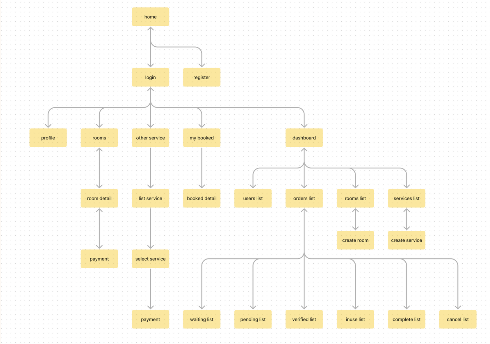

# Pet Care
Pet Services Booking Website 
เว็บไวต์สำหรับการจองโรงแรมและบริการอื่น ๆ สำหรับสัตว์เลี้ยงของร้าน Pet Care

สมาชิก
1. 6410406631 ธัญมาศ ฉันเจริญ
2. 6410406533 ชนิตพล โลหะมงคล
3. 6410450117 ชยกร เจียรสุวิกานต์
4. 6410450133 ณพณภัทร นรศรี


# Nuxt 3 Minimal Starter

Look at the [Nuxt 3 documentation](https://nuxt.com/docs/getting-started/introduction) to learn more.

## Setup

Make sure to install the dependencies:

```bash
# npm
npm install

# pnpm
pnpm install

# yarn
yarn install
```

## Development Server

Start the development server on `http://localhost:3000`:

```bash
# npm
npm run dev

# pnpm
pnpm run dev

# yarn
yarn dev
```

## Production

Build the application for production:

```bash
# npm
npm run build

# pnpm
pnpm run build

# yarn
yarn build
```

Locally preview production build:

```bash
# npm
npm run preview

# pnpm
pnpm run preview

# yarn
yarn preview
```

Check out the [deployment documentation](https://nuxt.com/docs/getting-started/deployment) for more information.


# User Persona
คนแรก
1.  ชื่อ: สมชาย
อายุ: 32 ปี
อาชีพ: พนักงานขาย
สถานะ: โสด 
2. ชีวประวัติ: คุณสมชาย เป็นพนักงานขาย จำเป็นต้องเดือนทางไปต่างจังหวัดบ่อยครั้ง เพื่อขายของให้ลูกค้า โดยคุณสมชายอยู่คอนโดคนเดียว และเลี้ยงแมวพันธุ์สฟิงซ์ 1 ตัว มักใช้บริการโรงแรมแมวบ่อยครั้ง เวลาที่ไปต่างจังหวัด และชอบใช้บริการออนไลน์ เพื่อความง่าย และสะดวก
3. ความต้องการหลัก: ต้องการบริการจองห้องออนไลน์ที่ใช้งานสะดวกและง่าย

คนที่สอง
1. ชื่อ: โบนัส
อายุ: 29 ปี
อาชีพ: พนักงานของร้าน Pet Care
สถานะ: โสด 
2. ชีวประวัติ: คุณโบนัสเป็นพนักงานดูแลการจองใช้บริการ ดูแลและบันทึกการจองของลูกค้า โดยลูกค้าจะใช้การโทรมาจอง จากนั้นคุณโบนัสจะทำการจดบันทึกวันที่ลูกค้าต้องการใช้บริการ และรายละเอียดการจอง
3. ความต้องการหลัก: ต้องการระบบที่ช่วยบันทึกรายการจองของลูกค้า 

# UI FLOW


# Jira
https://chayakorn2002.atlassian.net/jira/software/projects/TADADADA/boards/2